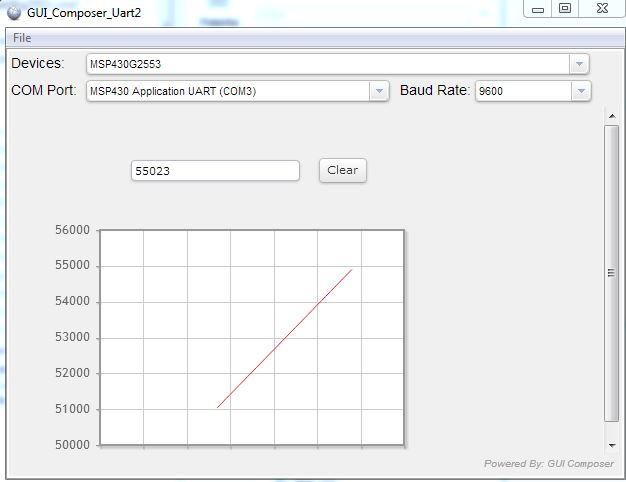

# MSP430-GUI-Composer
A short example on how to use the GUI Composer for the MSP430 Launchpad. 

Please follow the complete guide here: 

http://mcuhq.com/11/msp430-launchpad-gui-composer-example

## Introduction
A GUI is configured that plots the data received on a COM port at 9600 baud. The hardware UART on the MSP430 is used in conjunction with two "UART monitor" files that the GUI Composer interacts between as an API. The end result is a distributable standalone app (windows only however). 

## Required Tools

1. Code Composer Studio (CCS) v5.3+
2. MSP430 Launchpad
3. USB mini cable to connect between your computer and MSP430 Launchpad

## Setup

1. Download and install Code Composer Studio (CCS)
2. Install the Grace and MSP430 USB Driver
3. Clone this repo and open the project file inside CCS
4. Build and then test your app

## Issues

Please submit all issues to the github tracker. Pull requests are also encouraged. General comments can be left either inside github or at mcuhq.com

